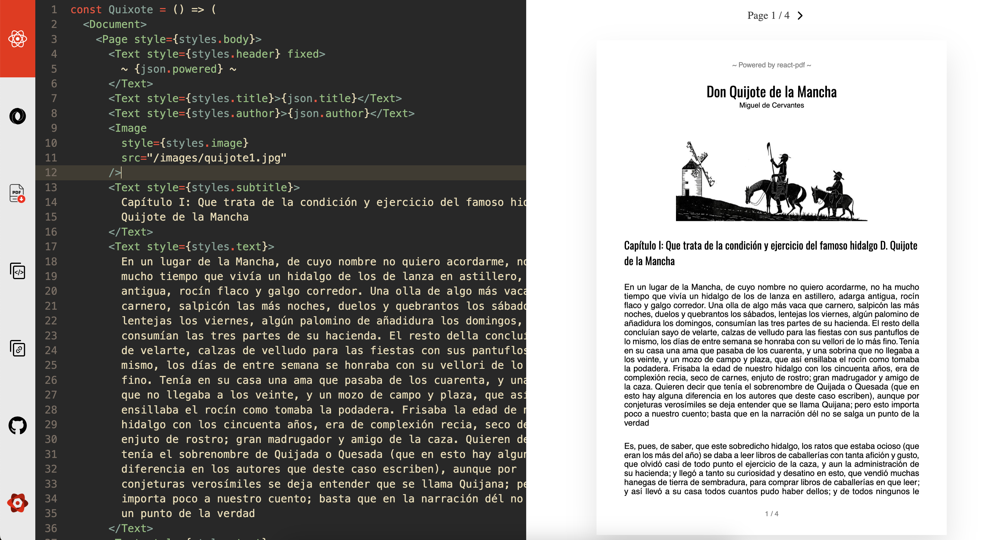

# PDF Kitchen 

A web app for cooking up PDF's with React and JSON. Powered by [React PDF](https://react-pdf.org).

## Preview:

## Features
1. Render PDFs dynamically using React.
2. Use JSON as source of data.
3. Share the code easily via URL.

## Docs

For more information on how to use this app and all the available components, please refer to [**React PDF docs**](ttps://react-pdf.org).

## Notes

This web app is based off the [REPL from react-pdf-site](https://github.com/diegomura/react-pdf-site).

Contributions welcomed.
